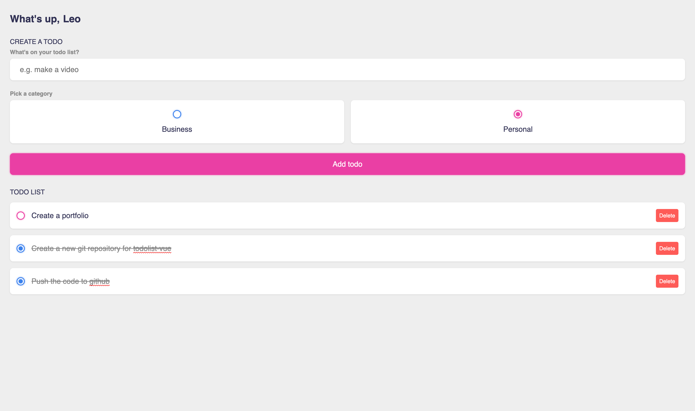

# todolist-vue

This is a simple todolist app to practice Vue 3. In this app is possible to include todos based on categories (Business or Personal).

The todolist is going to be saved on browser Local Storage.



## Project setup

```
npm install
```

### Compiles and hot-reloads for development

```
npm run serve
```

### Compiles and minifies for production

```
npm run build
```

### Lints and fixes files

```
npm run lint
```

### Customize configuration

See [Configuration Reference](https://cli.vuejs.org/config/).
